# 01-TARGET-ARCHITECTURE — from design tool to ERP

Planning document only — no code or schema changes are implied by merging it.
Source of truth for the current state: `lib/db/src/schema/` (35 files, 39 tables) as of the 2026-08-18
snapshot; evidence in `docs/00-AUDIT.md`.

---

## 1. Current ERD

Conventions: only structurally relevant columns shown. `FK` = enforced `.references()` (there are exactly
8, all `onDelete: cascade`). Any relationship labelled *(implied)* is a bare integer column with **no
database constraint today** — Phase 1 turns most of them into real FKs. All money is `numeric` except
`bom_rates` (float) and `report_settings.min_profit_percent` (float).

```mermaid
erDiagram
    %% ================= SALES CORE =================
    customers ||--o{ quotes : "customer_id (implied)"
    customers ||--o{ projects : "customer_id (implied)"
    customers ||--o{ design_requests : "customer_id (implied)"
    customers ||--o{ pos_sales : "customer_id (implied)"
    projects ||--o{ quotes : "project_id (implied)"
    quotes ||--o{ quote_items : "quote_id (implied, notNull, UNINDEXED)"
    quotes ||--o{ quote_payments : "quote_id (implied, notNull)"
    quotes ||--o{ quote_follow_ups : "quote_id FK cascade"
    quotes ||--o{ quote_handovers : "quote_id FK cascade"
    quotes ||--o{ design_share_links : "quote_id FK cascade"
    quotes ||--o{ quote_sign_links : "quote_id FK cascade"
    quote_items ||--o{ design_share_links : "quote_item_id FK cascade"
    users ||--o{ quote_handovers : "to_user_id FK cascade"
    users ||--o{ chase_digests : "user_id FK cascade"
    users ||--o{ quotes : "created_by +5 actor cols (implied)"
    design_requests ||--o{ design_request_follow_ups : "request_id FK cascade"
    design_requests ||--o| quotes : "converted_quote_id (implied)"

    customers {
        serial id PK
        text name
        text phone
        text phone_key UK "digits-only identity"
        text location
        text email
    }
    users {
        serial id PK
        text clerk_id UK
        text email UK
        text role "free text: admin|manager|factory_manager|sales|staff"
        boolean is_active
        boolean is_approved
    }
    quotes {
        serial id PK
        integer project_id "implied->projects, no index"
        integer customer_id "implied->customers"
        text quote_number UK "Q-year-NNNN"
        text status "free text draft|sent|signed|accepted|rejected"
        numeric subtotal "12,2"
        numeric discount_percent "5,2"
        numeric vat_percent "5,2"
        integer created_by "implied->users"
        timestamptz manager_approved_at "lifecycle driver"
        timestamptz sent_to_customer_at "lifecycle driver"
        text customer_signature "base64 PNG in-row"
        timestamptz customer_signed_at "lifecycle driver"
        timestamptz final_approved_at "lifecycle driver"
        timestamptz archived_at "soft delete"
    }
    quote_items {
        serial id PK
        integer quote_id "implied->quotes NO INDEX"
        integer window_type_id "implied->window_types"
        integer system_id "implied->systems"
        integer color_id "implied->colors"
        integer hardware_brand_id "implied"
        integer glass_type_id "implied"
        integer glass_option_id "implied"
        numeric width_mm
        numeric height_mm
        integer quantity
        numeric price_per_sqm "12,2"
        numeric unit_price "12,2"
        numeric total_price "12,2"
        jsonb extra_config "FULL design snapshot + base64 3D renders"
    }
    quote_payments {
        serial id PK
        integer quote_id "implied notNull"
        numeric amount "12,2"
        date received_on
        text method "cash|transfer|cheque|card"
    }
    projects {
        serial id PK
        integer customer_id "implied"
        text status "active|production|completed|cancelled"
        timestamptz production_started_at
        timestamptz production_due_at
        jsonb production_stages "UNTYPED - the 3/14/3/7 stub"
    }
    design_requests {
        serial id PK
        text request_number UK "DR-year-NNNN"
        integer customer_id "implied"
        text status "new|handled|archived"
        jsonb items "child table flattened into jsonb"
        jsonb photo_paths
        integer converted_quote_id "implied, unique-by-comment only"
    }
    design_share_links {
        serial id PK
        text token UK "192-bit"
        text status "active|expired|revoked|approved"
        timestamptz expires_at "3-4 days"
    }
    quote_sign_links {
        serial id PK
        text token UK "192-bit"
        text status "active|expired|revoked|signed|invalidated"
        timestamptz expires_at "1-30 days"
    }
    quote_follow_ups { serial id PK }
    quote_handovers { serial id PK }
    chase_digests {
        serial id PK
        jsonb quote_ids "join table in jsonb"
        date digest_day
    }
    design_request_follow_ups { serial id PK }

    %% ================= POS =================
    pos_products ||--o{ pos_stock_movements : "product_id (implied, indexed)"
    pos_products ||--o{ pos_sale_items : "product_id (implied, nullable)"
    pos_sales ||--o{ pos_sale_items : "sale_id (implied, indexed)"
    pos_sales ||--o{ pos_payments : "sale_id (implied, indexed)"
    pos_sales ||--o{ pos_stock_movements : "sale_id (implied)"

    pos_products {
        serial id PK
        text code UK
        text category "profile|steel|accessory|other"
        text unit "piece|length|m|m2|kg|set|box|roll"
        numeric unit_price "12,2"
        numeric cost_price "12,2 null=UNKNOWN"
        numeric bar_meters "12,3 UoM hint"
        numeric package_qty "12,2 UoM hint"
        numeric stock_qty "12,2 DERIVED-BUT-STORED"
        numeric low_stock_at "reorder hint"
        text system_name "denormalized"
        text color_name "denormalized"
    }
    pos_stock_movements {
        serial id PK
        integer product_id "implied notNull"
        numeric delta "12,2 signed - append-only ledger"
        text reason "sale|return|purchase|adjust"
        integer sale_id "implied"
        integer created_by "implied->users"
    }
    pos_sales {
        serial id PK
        text sale_number UK "POS-year-NNNN"
        text status "draft|pending|approved|delivered|cancelled"
        text share_token "indexed NOT unique, never expires"
        numeric discount_percent
        numeric vat_percent
    }
    pos_sale_items {
        serial id PK
        text sale_unit "base|bar|package"
        numeric unit_factor "12,3 base-unit conversion"
        numeric unit_price "12,2"
        numeric unit_cost "12,2"
    }
    pos_payments { serial id PK }

    %% ================= CATALOG =================
    systems ||--o{ profiles : "system_id (implied notNull)"
    systems {
        serial id PK
        text name "not unique"
    }
    profiles {
        serial id PK
        integer system_id "implied notNull, no index"
        text code "not unique"
        text profile_type "free text OUTER_FRAME|SASH|..."
        numeric price_per_meter "10,4"
        numeric weight_per_meter "10,4"
    }
    window_types {
        serial id PK
        text code UK
        boolean is_fabricated "false = carpentry/cladding"
        numeric default_price_per_sqm
    }
    colors { serial id PK }
    hardware_brands { serial id PK }
    glass_types { serial id PK }
    glass_options { serial id PK }
    pricing_rules { serial id PK }
    templates {
        serial id PK
        jsonb profile_overrides
        jsonb extra_config
    }
    bom_rates {
        serial id PK "singleton id=1"
        double glass_price_per_m2 "FLOAT x9 cols"
        jsonb hardware_prices "keyed by display name"
    }
    report_settings {
        serial id PK "singleton id=1"
        double min_profit_percent "FLOAT"
    }

    %% ================= PLATFORM =================
    activity_log {
        serial id PK
        text source_key UK "idempotent backfill"
        text entity_type "polymorphic + entity_id"
        jsonb changes "audit diff"
    }

    %% ================= PUBLIC SITE CMS =================
    site_products { serial id PK }
    site_settings { serial id PK "singleton" }
    site_submissions { serial id PK }
    site_text_overrides { text key PK }
    news_posts { serial id PK }
    team_members { serial id PK "marketing bios NOT HR" }
    media_items { serial id PK }
    reference_projects { serial id PK }
    certificates { serial id PK }
```

Structural reading of the current state:
- **Three clusters**: sales core (quotes/projects/customers + links), POS (a self-contained mini-inventory
  that already has the ledger idea), catalog (referenced by id from quote items). The site CMS cluster is
  disconnected from everything (it serves the absent `factory-website`).
- **The design payload lives outside the relational model** (`quote_items.extra_config`), which is why
  share links, design requests and the costing engine all pass jsonb snapshots around.
- **`users` is authentication, not HR** (Clerk id + role + approval gate — nothing else). `team_members`
  is marketing content. HR starts from zero and must not be conflated with either.

---

## 2. Target ERD

Module-level: entities named, key relationships shown, existing tables marked `[existing]`. Detailed
per-module data models (every column, every constraint) are delivered at each module's build start per the
working rules — this diagram fixes the *boundaries and join points*, not final column lists.

```mermaid
erDiagram
    %% ============ PARTY / IDENTITY (existing, generalised) ============
    customers ||--o{ quotes : ""
    customers ||--o{ sales_invoices : ""
    users ||--o| employees : "user_id nullable 1:1"
    suppliers ||--o{ purchase_orders : ""

    customers { int id PK "[existing]" }
    users { int id PK "[existing] auth+role only" }
    suppliers { int id PK "NEW supplier master + doc expiry + scorecard" }

    %% ============ INVENTORY (generalised from POS) ============
    items ||--o{ stock_moves : ""
    items ||--o{ item_uoms : "bar/metre/kg/piece conversions"
    items ||--o{ item_lots : "lot/batch incl. extrusion + offcuts"
    warehouses ||--o{ bins : ""
    bins ||--o{ stock_moves : "from_bin/to_bin"
    item_lots ||--o{ stock_moves : ""
    stock_counts ||--o{ stock_count_lines : "variance approval"
    items ||--o{ reorder_rules : "generalised low_stock_at"

    items { int id PK "[existing pos_products, promoted] + kind: good|profile|steel|accessory|offcut|spare|consumable" }
    stock_moves { int id PK "[existing pos_stock_movements, generalised] + qty base-UoM + from/to bin + lot + doc ref + posting is APPEND-ONLY" }
    warehouses { int id PK "NEW" }
    bins { int id PK "NEW" }
    item_uoms { int id PK "NEW - absorbs bar_meters/package_qty" }
    item_lots { int id PK "NEW" }
    stock_counts { int id PK "NEW cycle counts + stock takes" }
    stock_count_lines { int id PK "NEW" }
    reorder_rules { int id PK "NEW" }
    item_valuations { int id PK "NEW weighted-average layers" }

    %% ============ MANUFACTURING ============
    quotes ||--o{ work_orders : "from final-approved quote"
    work_orders ||--o{ wo_operations : "routing steps"
    work_centres ||--o{ machines : ""
    machines ||--o{ wo_operations : ""
    wo_operations ||--o{ op_events : "start/stop/scrap/downtime via QR"
    work_orders ||--o{ wo_materials : "issues against stock_moves"
    wo_materials }o--|| stock_moves : "material issue"
    work_orders ||--o{ cut_plans : "1D nesting from fab snapshot"
    cut_plans ||--o{ offcuts : "written back as items kind=offcut"
    machines ||--o{ extrusion_batches : "compound lot, kg, scrap %, regrind"
    wo_operations ||--o{ qc_inspections : "plans, defects, disposition"
    fabrication_snapshots ||--o{ cut_plans : ""
    quote_items ||--|| fabrication_snapshots : "immutable at final approval (Phase 1)"

    work_orders { int id PK "REPLACES projects.production_stages jsonb; WO-year-NNNN" }
    wo_operations { int id PK "extrusion>cutting>machining>welding>cleaning>glazing>assembly>QC>packing" }
    work_centres { int id PK "NEW" }
    machines { int id PK "NEW shared with Maintenance" }
    op_events { int id PK "NEW append-only shop-floor ledger" }
    wo_materials { int id PK "NEW" }
    cut_plans { int id PK "NEW deterministic nesting, kerf + min remnant" }
    offcuts { int id PK "NEW first-class stock" }
    extrusion_batches { int id PK "NEW" }
    qc_inspections { int id PK "NEW" }
    fabrication_snapshots { int id PK "NEW Phase 1 - BOM + cuts + rates frozen per quote item" }
    shift_calendars { int id PK "NEW Sun-Thu + shifts; also used by HR + scheduling" }

    %% ============ PROCUREMENT ============
    requisitions ||--o{ rfqs : ""
    rfqs ||--o{ supplier_quotes : "comparison"
    supplier_quotes ||--o{ purchase_orders : ""
    purchase_orders ||--o{ grns : ""
    grns ||--o{ stock_moves : "GRN posts the ledger"
    purchase_orders ||--o{ supplier_invoices : "3-way match PO+GRN+invoice"
    import_shipments ||--o{ landed_costs : "freight/customs/clearance into item cost"

    requisitions { int id PK "NEW" }
    rfqs { int id PK "NEW" }
    supplier_quotes { int id PK "NEW" }
    purchase_orders { int id PK "NEW PO-year-NNNN" }
    grns { int id PK "NEW GRN-year-NNNN" }
    supplier_invoices { int id PK "NEW" }
    import_shipments { int id PK "NEW" }
    landed_costs { int id PK "NEW" }

    %% ============ HR (new cluster - users stays auth-only) ============
    employees ||--o{ employee_documents : "QID/passport/visa/permit/health card + expiry alerts"
    employees ||--o{ attendance_records : "biometric import"
    employees ||--o{ leave_requests : "Qatar Labour Law accrual"
    employees ||--o{ payroll_lines : ""
    payroll_runs ||--o{ payroll_lines : "WPS SIF export"
    employees ||--o{ loans : "ATPF-HR-FIN-CA-01, Article 70 cap in code"
    employees ||--o{ eos_calculations : "gratuity brackets"
    departments ||--o{ employees : ""
    cost_centres ||--o{ employees : ""

    employees { int id PK "NEW employee master; users.id nullable link" }
    employee_documents { int id PK "NEW" }
    attendance_records { int id PK "NEW" }
    leave_requests { int id PK "NEW" }
    payroll_runs { int id PK "NEW" }
    payroll_lines { int id PK "NEW" }
    loans { int id PK "NEW" }
    eos_calculations { int id PK "NEW" }
    departments { int id PK "NEW org structure" }

    %% ============ FINANCE ============
    quotes ||--o{ sales_invoices : "invoice supersedes none - quotes stay"
    sales_invoices ||--o{ ar_entries : "aging"
    quote_payments }o--|| ar_entries : "[existing] becomes a receipt source"
    supplier_invoices ||--o{ ap_entries : ""
    cost_centres ||--o{ ar_entries : ""
    fixed_assets ||--o{ depreciation_entries : ""

    sales_invoices { int id PK "NEW INV-year-NNNN bilingual VAT-ready + credit notes" }
    ar_entries { int id PK "NEW" }
    ap_entries { int id PK "NEW" }
    expense_claims { int id PK "NEW" }
    cost_centres { int id PK "NEW shared with HR/projects" }
    fixed_assets { int id PK "NEW" }
    depreciation_entries { int id PK "NEW" }

    %% ============ MAINTENANCE ============
    machines ||--o{ pm_schedules : "calendar/hours/cycles"
    machines ||--o{ maintenance_orders : "breakdown WOs consume spares"
    maintenance_orders }o--|| stock_moves : "spares issue"
    machines ||--o{ downtime_events : "linked to production loss"

    pm_schedules { int id PK "NEW" }
    maintenance_orders { int id PK "NEW" }
    downtime_events { int id PK "NEW shared with op_events" }

    %% ============ PROJECTS & INSTALLATION (extend existing) ============
    projects ||--o{ site_surveys : "measurement sheets"
    projects ||--o{ installation_visits : "crew scheduling"
    projects ||--o{ snag_items : ""
    projects ||--o{ warranty_registrations : "claims"

    projects { int id PK "[existing, extended - production_stages jsonb retired]" }
    site_surveys { int id PK "NEW" }
    installation_visits { int id PK "NEW" }
    snag_items { int id PK "NEW" }
    warranty_registrations { int id PK "NEW" }

    %% ============ CORE PLATFORM ============
    doc_sequences { int id PK "NEW per-type numbering QT/WO/GRN/INV - replaces scan-max+1" }
    approval_workflows { int id PK "NEW configurable N-step + delegation" }
    approval_steps { int id PK "NEW" }
    notifications { int id PK "NEW in-app/email/WhatsApp Business" }
    saved_views { int id PK "NEW per-list" }
    ai_calls { int id PK "NEW audit console: prompt/output/user/cost/accepted" }
    activity_log { int id PK "[existing] feeds anomaly detection" }
```

---

## 3. Module boundaries and package mapping

Rule: **one domain = one route directory + one service lib + one schema directory.** The current flat
`lib/db/src/schema/*.ts` is re-organised into per-module folders (pure file moves, barrel preserved — not
a schema migration).

| Module | Schema dir (`lib/db/src/schema/`) | Server code | Client area | New packages |
|---|---|---|---|---|
| Sales (exists) | `sales/` (quotes, items, payments, links, follow-ups, handovers, digests, design requests) | `routes/quotes*`, `lib/quote*` | quotes/configurator/carpentry pages | — |
| Catalog (exists) | `catalog/` | catalog routes | price-list/admin pages | — |
| Inventory | `inventory/` (items, stock_moves, warehouses, bins, lots, uoms, counts, valuations) | `routes/inventory/`, `lib/inventory/` (posting engine) | warehouse UI (large-touch) | `@workspace/inventory` (posting + valuation math, pure) |
| Manufacturing | `manufacturing/` | `routes/manufacturing/`, `lib/manufacturing/` | shop-floor terminal (Arabic-first, offline-tolerant) | `@workspace/nesting` (deterministic 1D cutting, pure + tested) |
| Procurement | `procurement/` | `routes/procurement/` | procurement desktop | — |
| HR & Payroll | `hr/` | `routes/hr/`, `lib/hr/` | HR desktop + ESS mobile | `@workspace/payroll-qa` (Labour Law math: overtime, leave accrual, gratuity, Article 70, WPS SIF — pure, exhaustively tested) |
| Finance | `finance/` | `routes/finance/` | finance desktop | `@workspace/finance` (aging, depreciation — pure) |
| Maintenance | `maintenance/` | `routes/maintenance/` | tablet UI | — |
| Projects & Installation | extend `sales/projects` → `projects/` | `routes/projects*` | existing projects pages extended | — |
| Core platform | `platform/` (doc_sequences, approvals, notifications, saved_views, ai_calls) | `lib/platform/` (numbering, approval engine, notifier), `lib/authz.ts` (Phase 1) | shared components | `@workspace/ai` (provider-agnostic AI service) |
| Site CMS (exists) | `site/` | `routes/site*` | factory-website | — |

Cross-cutting invariants:
- **Contract-first stands**: every new endpoint enters `openapi.yaml` first; Orval generates both sides.
  The spec will grow past 6,400 lines — split into multiple YAML files joined by `$ref` if Orval tooling
  allows, else keep one file with strict tag discipline (decide at Phase 2 start).
- **Calculation logic lives in pure workspace libs** (`costing` is the proven pattern) — server routes
  orchestrate, libs compute, vitest locks behaviour. Payroll/nesting/valuation must be built this way from
  day one.
- **Every ledger is append-only with derived balances** (`pos_stock_movements` semantics, generalised):
  stock on-hand, AR/AP balances, WIP — never a directly-edited column. `stock_moves` gains an idempotency
  `source_key` like `activity_log` already has.
- **The authorization module (Phase 1) is the only place roles are interpreted.** New roles
  (`storekeeper`, `production_supervisor`, `machine_operator`, `hr`, `accountant`, `procurement`,
  `maintenance`) are added there, never inline in routes.

---

## 4. Existing tables: generalised vs replaced vs left alone

| Table | Fate | Justification |
|---|---|---|
| `pos_products` | **Generalised → `items`** | Already has code/category/unit/cost/bar/package/lowStock — 80% of an item master. POS becomes one consumer. Rename via migration + updatable view `pos_products` during transition so POS routes keep working. |
| `pos_stock_movements` | **Generalised → `stock_moves`** | Already append-only signed-delta with reasons. Gains: warehouse/bin, lot, base-UoM qty, document reference (GRN/WO/sale), idempotency key. Existing rows migrate as the opening ledger of the default warehouse. |
| `pos_sales` / `pos_sale_items` / `pos_payments` | **Left alone** (FK targets updated to `items`) | Counter-sale flow is complete and well-built. `pos_payments` merges into the Finance receipt model only when AR lands (it is structurally identical to `quote_payments` — one migration, low risk). |
| `quotes` + `quote_items` + links + follow-ups | **Left alone** (hardened in Phase 1: FKs, indexes, transactions, snapshot) | Protected area. Work orders *reference* quotes; nothing replaces them. `customerSignature` moves to a side table opportunistically (row bloat), not urgently. |
| `quote_payments` | **Generalised (kept + wrapped)** | Becomes the AR receipt source; AR entries reference it rather than replacing it, so the existing payments UI keeps working. |
| `projects` | **Extended; `production_stages` jsonb retired** | Stays the customer-facing container (surveys, installation, warranty). The jsonb stub keeps working until work orders ship, then a compatibility read maps WO status → stage view before the column is dropped. |
| `customers` | **Left alone, promoted to shared party master** | Phone-key identity works. Gains soft delete + PDPPL classification. Suppliers get their own table (different lifecycle/fields) — not a generic "party" abstraction; that's over-engineering for one factory. |
| `users` | **Left alone — stays auth+role only** | HR gets a separate `employees` master with a nullable `user_id` link. Not every employee has a login (machine operators may only clock via QR); not every user is an employee. Conflating them is the classic ERP mistake. |
| `team_members` | **Left alone** | Marketing content for the public site. Never link it to HR. |
| `bom_rates` | **Replaced → normalised rate tables with effective dates** | Float columns + display-name-keyed jsonb prices; the fabrication snapshot (Phase 1) needs versioned rates. Old singleton stays readable until the engine switches. |
| `report_settings`, `site_settings` | **Left alone** (float column fixed in Phase 1) | Settings singletons are fine. |
| Catalog (`systems`, `profiles`, `colors`, `glass_*`, `hardware_brands`, `window_types`, `pricing_rules`, `templates`) | **Left alone** (+ unique/index hardening; `profiles` gains `(system_id, code)` unique) | The costing engine reads them; churn here risks quote correctness for no gain. Items master references profiles for uPVC stock. |
| `design_requests` | **Left alone**; `items` jsonb → child table only if request analytics ever need it | Public flow works and is well-defended. |
| `activity_log` | **Left alone — becomes an ERP asset** | Polymorphic append-only audit with idempotent backfill; anomaly detection (AI #8) reads it as-is. New modules register activity rules. |
| `chase_digests` | **Left alone** | Feeds the morning brief later; jsonb quote_ids is tolerable for a notification cache. |
| Site CMS tables | **Left alone** | Different bounded context entirely. |
| `lib/db/src/data/price-list-2026.ts` | **Replaced by data** | The 423-line hardcoded price list becomes seed data for `items` + a price-list import; retired as code. |

---

## 5. Migration strategy — strangler fig

Non-negotiable constraint: **configurator, quotation flow, share/sign links and POS keep working at every
step.** Each numbered step ships alone and is independently revertible.

**Step 0 — safety net first (Phase 1, in this order):**
1. Vitest characterization tests golden-file the engine (`fabrication`, `bom`, `quote-cost`, `quoteMoney`,
   `posMoney`, `billedDims`) against real fixtures. Nothing below happens before this is green.
2. Migration toolchain: `drizzle-kit generate` + `migrate`; live schema stamped as migration `0000`;
   `push` fenced to local dev; the broken `post-merge.sh` filter fixed.
3. Orphan scan (SQL in `00-AUDIT.md` §2.2) → repair or NULL-out → FK + index migrations in small batches
   (children of `quotes` first, then actor columns with `onDelete: set null`, then POS, then catalog).
4. `numeric` conversion for `bom_rates` / `min_profit_percent` (values are small — lossless cast, verified
   by the golden files).
5. Fabrication snapshot: new `fabrication_snapshots` table written at final approval; reports read the
   snapshot when present, recompute when absent (all historical quotes). **Cutover risk #1** — proven
   byte-identical via the characterization suite before the client PDFs switch to server-provided
   snapshot data.
6. Boot seeders → `scripts/src/db-seed.ts` + `db-backfill.ts` commands; boot becomes read-only.
   **Cutover risk #2** — a fresh environment now *requires* running seeds explicitly; document in README
   and post-merge hook.
7. `lib/authz.ts`: table-driven policy + per-request cached user context; routes migrate guard-by-guard
   (mechanical, verifiable by the existing e2e scripts + new authz unit tests).
8. Transactions + the two WHERE guards on approve/final-approve (owner sign-off required — protected area).

**Step 1 — platform primitives (small, unblocking):** `doc_sequences` (new documents only — existing
Q-/POS-/DR- numbering untouched until proven), soft-delete convention decided once, notification engine
skeleton (in-app only first), role list extended in `authz.ts`.

**Step 2 — Inventory strangler:**
- Migration renames `pos_products` → `items` (+ new columns, nullable) and creates **updatable view
  `pos_products`** so every existing POS query keeps working. **Cutover risk #3** (rename + view under
  live traffic; rehearse on a DB copy).
- `stock_moves` gains warehouse/bin/lot/uom/source columns with defaults = current behaviour (single
  implicit warehouse). POS keeps posting exactly as today.
- On-hand derivation: nightly job reconciles `stock_qty` against Σ(moves) and *reports* drift; when drift
  is zero for two weeks, `stock_qty` becomes a materialised/derived value. **Cutover risk #4** — the
  moment on-hand stops being editable; storekeeper adjustment flow must exist first.
- Then: warehouses/bins UI, counts, valuations, offcut item kind — additive.

**Step 3 — Manufacturing strangler:**
- `work_orders` created *alongside* `projects.production_stages`; final approval writes both. The projects
  page renders WO-derived stages behind a flag; when accepted, the jsonb write stops and the column is
  dropped two releases later. **Cutover risk #5.**
- Shop-floor events, material issue (posts `stock_moves` — inventory must be live), cut plans fed by
  fabrication snapshots (Phase 1 dependency), offcuts written back.
- The Gantt/finite scheduling reads `shift_calendars` — the first place Sunday–Thursday becomes code.

**Step 4 — Procurement:** GRN posts `stock_moves`; 3-way match reads PO+GRN+supplier invoice. Pure
addition; no strangling needed. Landed cost mutates item valuation — **cutover risk #6** (valuation method
must be decided and tested before first real GRN).

**Step 5 — HR & Payroll:** entirely new cluster; `employees.user_id` links accounts. Payroll math in
`@workspace/payroll-qa` with an exhaustive edge-case suite *before* any UI. WPS SIF validated against the
bank's spec with fixture files. No strangling — but PDPPL controls (access logging via `activity_log`
rules, retention, export/erasure) ship *with* the module, not after.

**Step 6 — Finance:** invoices/AR wrap `quote_payments` (kept), AP wraps supplier invoices. GL
keep-vs-export decision gates the ledger depth (both options documented in `02-ROADMAP.md` — decision
needed).

**Steps 7+ — Maintenance, Projects & Installation extensions, AI features** attach to the primitives
above; none strangle anything existing.

**Named risky cutovers (each needs a rehearsal + rollback note in `docs/DECISIONS.md`):**
1. Client PDFs render server fabrication snapshots (Phase 1.5)
2. Boot becomes read-only (Phase 1.6)
3. `pos_products` → `items` rename under the compatibility view (Step 2)
4. Stock on-hand becomes ledger-derived, not editable (Step 2)
5. `production_stages` jsonb retired in favour of work orders (Step 3)
6. First landed-cost posting into item valuation (Step 4)
7. First live payroll run + WPS submission (Step 5) — parallel-run against the manual process for ≥1 cycle
